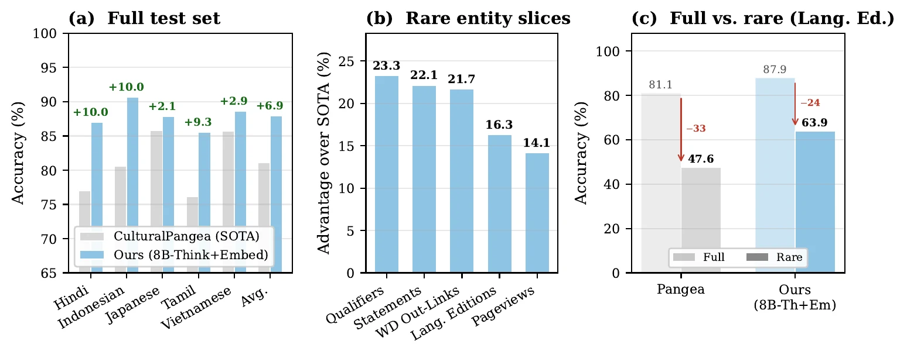
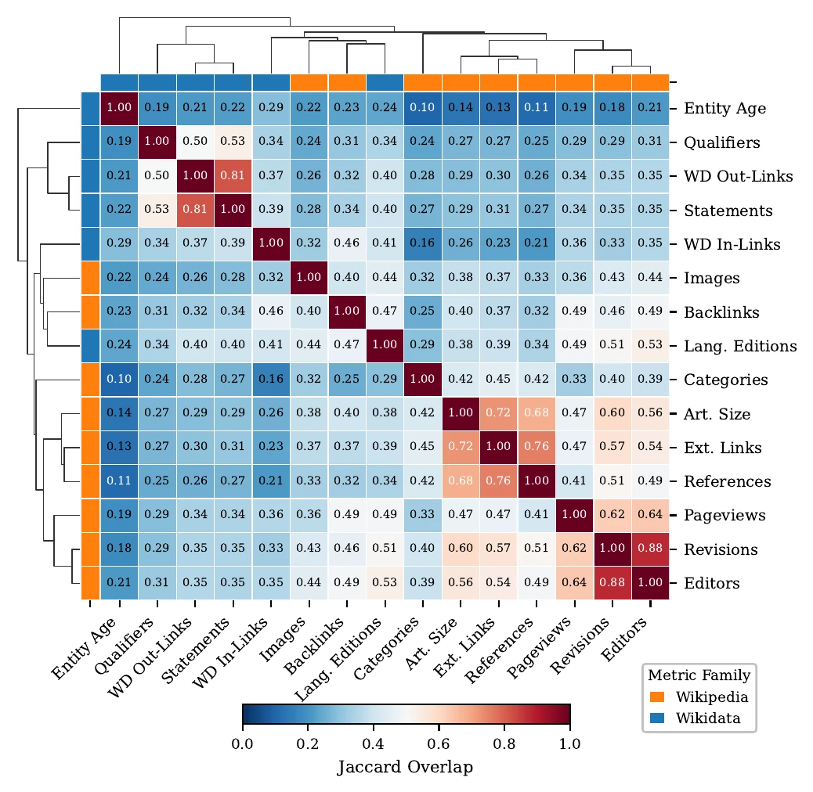
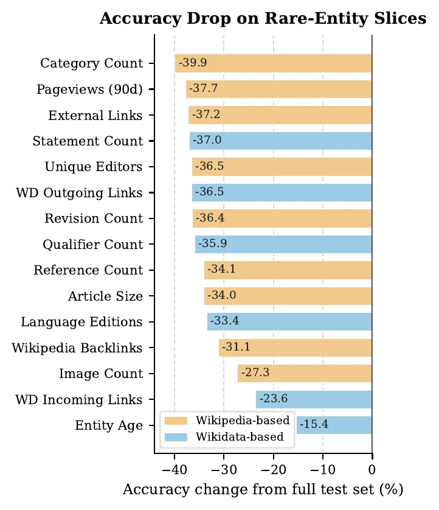
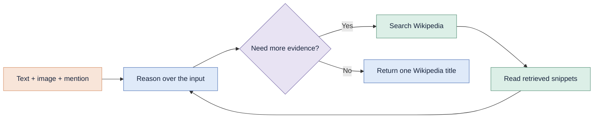
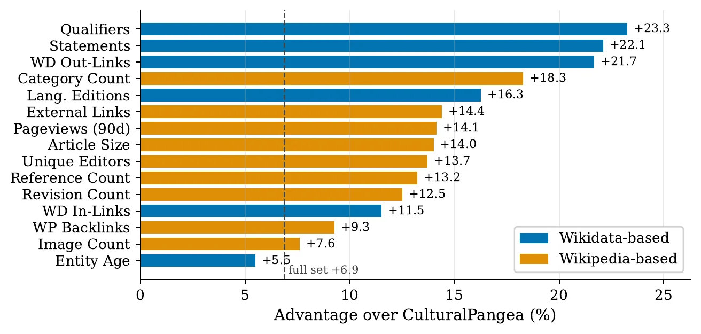

<p align="center">
  <a href="https://neulab.github.io/think-before-you-link/">
    
  </a>
</p>

<h1 align="center">[EMNLP 2026] Think Before You Link</h1>

<h3 align="center">Rarity, Reasoning, and Retrieval in Multilingual Entity Linking</h3>

<p align="center">
  <a href="https://parinzee.github.io/"><strong>Parinthapat Pengpun</strong></a>
  &nbsp;·&nbsp;
  <a href="https://simran-khanuja.github.io/"><strong>Simran Khanuja</strong></a>
  &nbsp;·&nbsp;
  <a href="https://www.phontron.com/"><strong>Graham Neubig</strong></a>
  <br>
  <a href="http://www.cs.cmu.edu/~neulab/">NeuLab</a> · Carnegie Mellon University
</p>

<p align="center">
  <a href="https://neulab.github.io/think-before-you-link/"></a>
  <a href="https://huggingface.co/datasets/neulab/merlin-rare"></a>
  <a href="LICENSE"></a>
  
</p>

<p align="center">
  <strong>Popularity is not rarity.</strong><br>
  Prior work usually defines rare entities using popularity metrics such as pageviews.
  We show that these definitions miss many entities that are poorly documented or weakly connected,
  causing previous evaluations to underestimate the scope of the rare-entity problem.
</p>

<p align="center">
  <a href="https://neulab.github.io/think-before-you-link/">
    
  </a>
</p>

<p align="center">
  <a href="#what-current-evaluation-misses">Research summary</a> ·
  <a href="#quick-start">Quick start</a> ·
  <a href="#repository-map">Repository map</a> ·
  <a href="#merlin-rare">MERLIN-Rare</a> ·
  <a href="#citation">Citation</a>
</p>

---

## At a glance

| **15 rarity signals** | **37% mean overlap** | **15.4–39.9% baseline drop** | **Up to +23.3% gain** |
|:---:|:---:|:---:|:---:|
| Popularity, documentation, structure, and cross-lingual coverage | Different definitions identify largely different entities | Cultural Pangea degrades across the rare-entity slices | The largest improvements occur on structural rare slices |

## What current evaluation misses

Most prior work uses popularity to decide which entities are rare. We also measure whether an entity is well documented, connected in Wikidata, and covered across languages. The two approaches identify different entities, and current systems struggle on the cases that popularity-based evaluation misses.

<table>
  <tr>
    <td width="50%" align="center">
      
      <br>
      <sub><strong>Different definitions find different entities.</strong><br>Bottom-5% sets overlap by only 37% on average.</sub>
    </td>
    <td width="50%" align="center">
      
      <br>
      <sub><strong>The missed cases are difficult.</strong><br>Baseline accuracy drops across all 15 rare-entity slices.</sub>
    </td>
  </tr>
</table>

## Framework

The framework is training-free. A vision-language model reads the source-language text and image, searches English Wikipedia, reasons over the retrieved evidence, and returns one canonical Wikipedia title.



Retrieval runs force the first Wikipedia tool call because small models often skip search when the tool is only optional. Every later search decision is made by the model, with a maximum of 20 iterations.

## Main results

- The best system reaches **87.9%** average accuracy, **+6.9%** over Cultural Pangea.
- Gains reach **+23.3%** on rare-entity slices, and 14 of 15 slice gains exceed the full-set gain.
- Reasoning and retrieval are complementary. Retrieval improves rare-entity accuracy without reasoning, but can hurt overall accuracy. Their combination performs best.
- A reasoning 4B model with embedding retrieval matches an 8B instruct model overall and performs better on several rare-entity slices.

<p align="center">
  
</p>

## Quick start

### 1. Install

Python 3.11 or newer is recommended.

```bash
git clone https://github.com/neulab/think-before-you-link.git
cd think-before-you-link

python -m venv .venv
source .venv/bin/activate
pip install -r requirements.txt
```

### 2. Materialize MERLIN-Rare

The Hugging Face release stores images inside Parquet files. This command exports the dataset into the local JSON and image layout used by the evaluator:

```bash
python scripts/materialize_hf_dataset.py \
  --repo-id neulab/merlin-rare \
  --split test \
  --output-dir data/merlin_rare
```

```text
data/merlin_rare/
├── dataset/
│   ├── hindi.json
│   ├── indonesian.json
│   ├── japanese.json
│   ├── tamil.json
│   └── vietnamese.json
└── images/
    ├── hindi/
    ├── indonesian/
    ├── japanese/
    ├── tamil/
    └── vietnamese/
```

To materialize the original MERLIN release, use `--repo-id neulab/merlin --split train`. The upstream repository uses the split name `train` even though MERLIN is an evaluation benchmark.

### 3. Start a model server

Serve the chosen Qwen3-VL checkpoint through an OpenAI-compatible endpoint. The paper uses SGLang. For a Thinking checkpoint:

```bash
python -m sglang.launch_server \
  --model-path Qwen/Qwen3-VL-8B-Thinking \
  --port 30000 \
  --reasoning-parser qwen3 \
  --tool-call-parser qwen
```

For an Instruct checkpoint, omit `--reasoning-parser qwen3`.

### 4. Run an evaluation

<details open>
<summary><strong>Embedding retrieval</strong> · best paper configuration</summary>

```bash
python -m merlin_eval \
  --rag --retriever embedding \
  --model Qwen/Qwen3-VL-8B-Thinking \
  --server_url http://localhost:30000/v1 \
  --merlin_dataset_dir data/merlin_rare/dataset \
  --merlin_images_dir data/merlin_rare/images \
  --wiki_index_path data/wikipedia_index.parquet \
  --embedding_cache_path data/wikipedia_embeddings_cache \
  --embedding_device cpu \
  --output_dir output/embedding \
  --layer1_max_tokens 32000 \
  --max_workers 10
```

</details>

<details>
<summary><strong>BM25 retrieval</strong></summary>

```bash
python -m merlin_eval \
  --rag --retriever bm25 \
  --model Qwen/Qwen3-VL-8B-Thinking \
  --server_url http://localhost:30000/v1 \
  --merlin_dataset_dir data/merlin_rare/dataset \
  --merlin_images_dir data/merlin_rare/images \
  --wiki_index_path data/wikipedia_index.parquet \
  --output_dir output/bm25 \
  --layer1_max_tokens 32000 \
  --max_workers 16
```

</details>

<details>
<summary><strong>No retrieval</strong></summary>

```bash
python -m merlin_eval \
  --model Qwen/Qwen3-VL-8B-Thinking \
  --server_url http://localhost:30000/v1 \
  --merlin_dataset_dir data/merlin_rare/dataset \
  --merlin_images_dir data/merlin_rare/images \
  --output_dir output/no_rag \
  --layer1_max_tokens 32000 \
  --max_workers 16
```

</details>

Each language produces a JSON file containing the prediction, target, score, reasoning, retrieved titles, tool conversation, token metadata, and duration. `run_config.json` records the complete run configuration.

## Build the Wikipedia index

Download the English namespace-0 shards from [`wikimedia/structured-wikipedia`](https://huggingface.co/datasets/wikimedia/structured-wikipedia), then run:

```bash
python scripts/build_wikipedia_index.py \
  --source-dir /path/to/structured-wikipedia/en \
  --output data/wikipedia_index.parquet
```

The index contains each English Wikipedia title, short description, URL, and Wikidata identifier. BM25 builds its local index on first use. Embedding retrieval uses `intfloat/multilingual-e5-large-instruct` with an exact FAISS index and requires approximately 30 GB of memory and storage at runtime.

## Repository map

```text
think-before-you-link/
├── merlin_eval/                  # Evaluation package
│   ├── config.py                 # CLI and run configuration
│   ├── pipeline.py               # Iterative reasoning and retrieval loop
│   ├── prompts.py                # Model and tool prompts
│   ├── retriever.py              # BM25 and embedding retrievers
│   ├── scoring.py                # MERLIN-compatible title scoring
│   └── run.py                    # Multilingual evaluation runner
├── scripts/
│   ├── build_wikipedia_index.py  # Build the title-description corpus
│   ├── materialize_hf_dataset.py # Export Hugging Face data locally
│   ├── build_merlin_rare_dataset.py
│   └── package_predictions.py    # Package predictions and lossless traces
├── tests/                        # Release and website integrity tests
├── docs/                         # GitHub Pages project site
├── requirements.txt
├── CITATION.cff
└── LICENSE
```

## Experiment grid

The controlled Qwen3-VL study evaluates the full Cartesian product:

| Dimension | Values |
|---|---|
| Model size | 2B, 4B, 8B |
| Model mode | Thinking, Instruct |
| Retrieval | None, BM25, multilingual embedding |
| Languages | Hindi, Indonesian, Japanese, Tamil, Vietnamese |

The 2B and 4B runs use 16,000 Layer-1 tokens. The 8B runs use 32,000. The paper also reports a second-family validation with GLM-4.6V-Flash.

## MERLIN-Rare

[MERLIN-Rare](https://huggingface.co/datasets/neulab/merlin-rare) contains **1,105 entity mentions** over **790 unique images**. It is the union of the bottom-5% sets for all 15 rarity metrics across five languages.

Each language configuration includes:

- the original MERLIN fields and image;
- all 15 metric values;
- within-language percentiles among examples with a valid English Wikipedia title;
- a `rare_<metric>` boolean for every slice;
- per-example predictions and lossless traces for every complete paper configuration.

```python
from datasets import load_dataset

dataset = load_dataset("neulab/merlin-rare", "hi", split="test")
language_edition_slice = dataset.filter(
    lambda row: row["rare_language_editions"]
)
```

Metric collection ran from October 7 through October 8, 2025. Pageviews cover a 90-day window. See the dataset card and `metadata/slice_counts.json` in the Hugging Face repository for complete definitions and counts.

## Tests

```bash
pip install -r requirements-dev.txt
pytest -q
```

The tests cover scoring behavior, Wikipedia-index extraction, MERLIN-Rare reconstruction, image materialization, the forced first retrieval call, and static-site integrity.

## Citation

```bibtex
@article{pengpun2026think,
  title  = {Think Before You Link: Rarity, Reasoning, and Retrieval in Multilingual Entity Linking},
  author = {Pengpun, Parinthapat and Khanuja, Simran and Neubig, Graham},
  year   = {2026}
}
```

Please also cite the original MERLIN paper when using MERLIN-Rare.

## Licenses

- Code is released under the [MIT License](LICENSE).
- MERLIN-Rare is released under [CC BY-SA 4.0](https://creativecommons.org/licenses/by-sa/4.0/).

<p align="center">
  <a href="https://neulab.github.io/think-before-you-link/"><strong>Project page</strong></a>
  &nbsp;·&nbsp;
  <a href="https://huggingface.co/datasets/neulab/merlin-rare"><strong>Dataset</strong></a>
  &nbsp;·&nbsp;
  <a href="#emnlp-2026-think-before-you-link"><strong>Back to top</strong></a>
</p>
